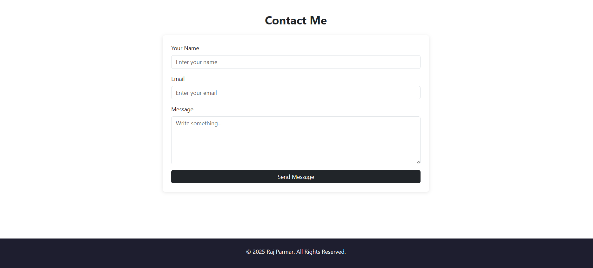

# Create-Custom-Server-Using-HTTP

# Custom HTTP Server 

यह प्रोजेक्ट एक Custom HTTP Server है जो आपके static pages (Home, Skills, Projects, Contact) को बिना किसी external framework के serve करता है। यह lightweight, fast और बिल्कुल simple implementation है जिसे आप अपने portfolio या learning projects में use कर सकते हैं।

---

## Website Screenshots

### 🏠 Home Page

### 🛠️ Skills And 📂 Projects Page

### 📞 Contact Page

---

## Features

- Custom-built HTTP server (Node.js)
- Multi-page static website
- No Express or external frameworks
- Fast static file serving
- Clean project structure
- Easy to customize

---

## Project Structure

